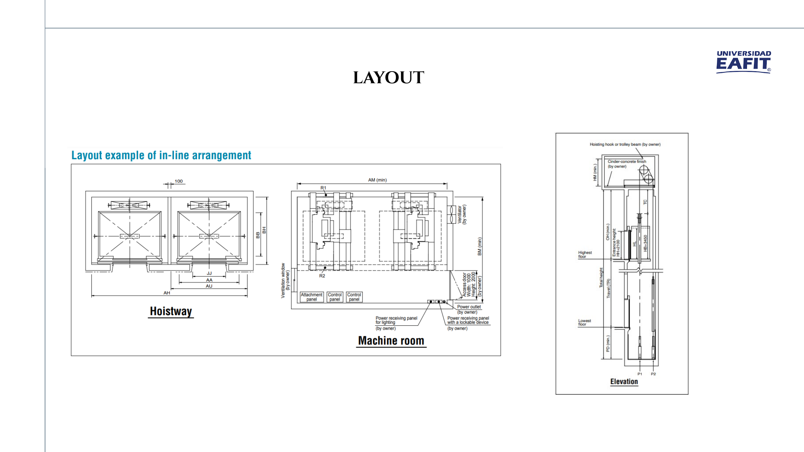
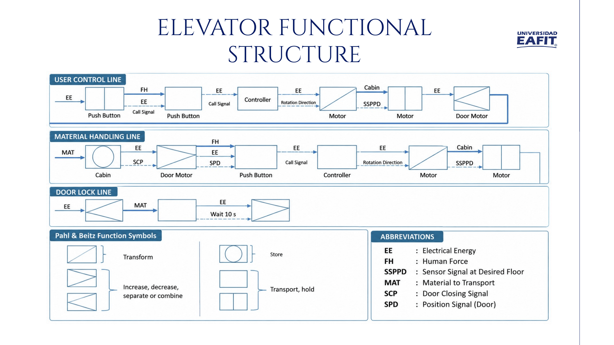
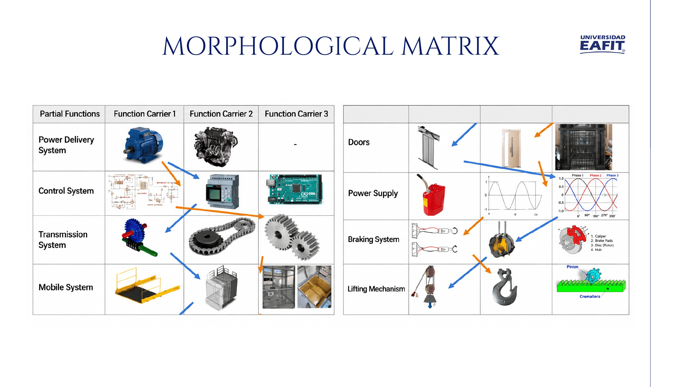
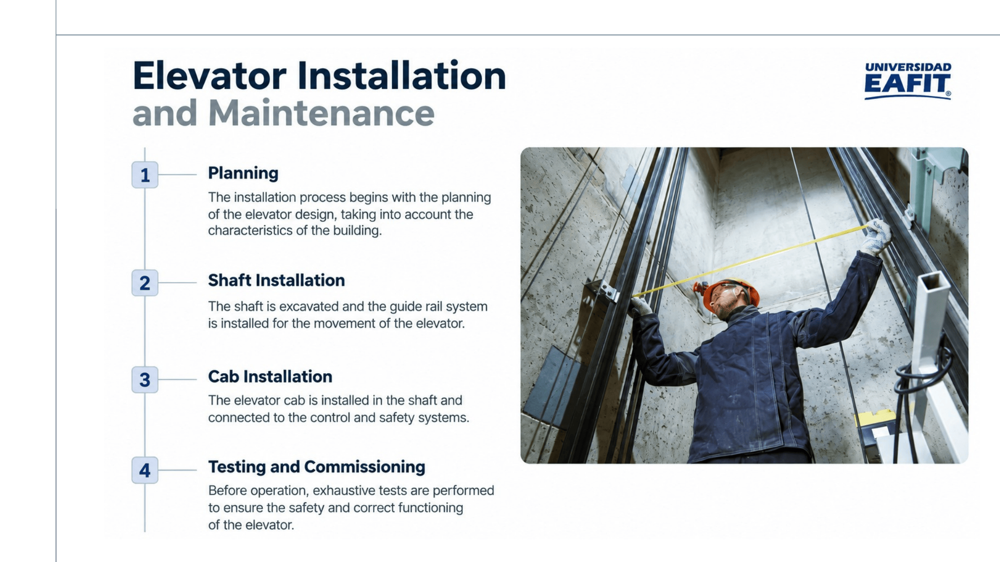
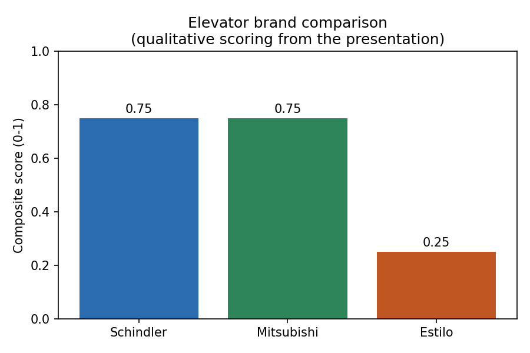
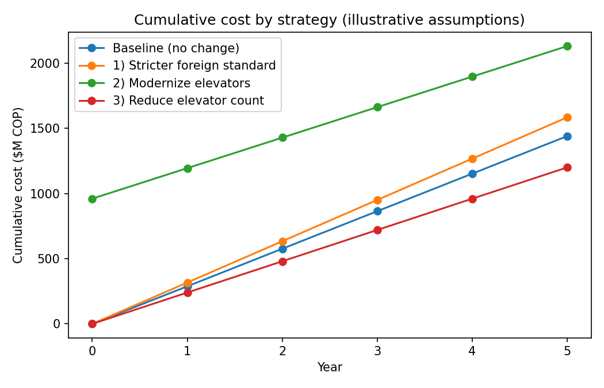

# Elevator Maintenance — Universidad EAFIT

Coursework study of the **elevator system at Universidad EAFIT**: how an elevator
works, which standards govern it in Colombia, which brands are installed on
campus, and which routes could realistically reduce the cost of keeping them
running.

The deliverable is the presentation in `01_Presentation/`. The Python model in
`02_Analysis/` was written afterwards to put numbers behind the three
cost-reduction routes the deck proposes — see the warning in
[Cost model](#cost-model-illustrative-numbers) before quoting any figure from it.

---

## Team

- Miguel Restrepo Carrasquilla
- Samuel Tamayo
- David Zuluaga Henao
- Santiago Quintero Álvarez
- Danilo Ocampo Vélez
- Tomás Arroyave Loaiza

Universidad EAFIT — Mechanical Engineering

---

## Repository layout

```
Elevator_Maintenance_EAFIT/
├── 01_Presentation/
│   ├── Elevator_Maintenance.pptx     original deck, 19 slides
│   └── Elevator_Maintenance.pdf      PDF export, for viewing without PowerPoint
├── 02_Analysis/
│   ├── elevator_cost_analysis.py     brand scoring + 5-year cost model
│   ├── cost_strategy_summary.csv     model output
│   ├── brand_comparison.png          model output
│   └── cost_strategy_projection.png  model output
├── docs/images/                      slide renders used in this README
└── README.md
```

---

## What an elevator is

Per the standard, an elevator is a permanently installed lifting device with a
car for people and goods, suspended by cables, chains, pulleys or pistons, with
a cable inclination from vertical of **less than 15°**.

Its operation combines mechanics, electronics and hydraulics. The deck breaks it
down into three core components — the **motor**, which drives the cable that
raises and lowers the car; the **car** itself; and the **counterweights**, which
balance the car and its passengers and so cut the energy the motor has to supply.

The control side is three parts: **sensors** (car position, passenger movement),
the **controller** that turns sensor data into motion commands, and the **user
interface** through which passengers request floors.

### Layout



Layout of an in-line arrangement: hoistway plan with the car and door
dimensions, machine room with the control and attachment panels and the
owner-supplied power feeds, and the elevation showing pit depth, travel,
overhead and total height.

### Functional structure (Pahl & Beitz)



The energy/signal/material flow through the system, drawn with the Pahl & Beitz
function symbols (transform, store, increase or decrease or separate or combine,
transport or hold). Three lines are laid out separately: the **user control
line** from the call button through the controller to the drive and door motors,
the **material handling line** from the cab through the door motor and back
through the controller to the drive, and the **door lock line** with its 10-second
hold.

Abbreviations: `EE` electrical energy, `FH` human force, `SSPPD` sensor signal at
desired floor, `MAT` material to transport, `SCP` door-closing signal, `SPD` door
position signal.

### Morphological matrix



Partial functions — power delivery, control, transmission, moving system, doors,
energy supply, braking and the lifting mechanism — each with up to three
candidate function carriers. Two complete solution paths are traced across the
matrix (blue and orange).

### Installation and maintenance



Four stages: planning the design around the building, excavating the shaft and
installing the guide system, installing the car and wiring it to the control and
safety systems, and exhaustive testing before commissioning.

### Safety features

Safety brake (stops the car if the main system fails), automatic doors,
emergency lighting and the alarm button that puts passengers in contact with
maintenance staff.

---

## Standards

| Standard | Scope |
|---|---|
| **NTC 5926-1** | Elevators, escalators, moving walkways and power-operated doors. Part 1 sets the safety and inspection requirements. |
| **NTC 4349** | Passenger and freight elevators — safety requirements for construction and installation. |

Two definitions the standards turn on:

- **Competent person** — someone with demonstrated ability to apply knowledge and
  skills to a given work activity.
- **Inspection** — examination of a product's design and of the product itself,
  and determination of its conformity with specific requirements or on the basis
  of professional judgement.

**Outside the scope of the standard:** shipboard and offshore lifting equipment,
elevators in mines or handling radioactive material, and rack-and-pinion
elevators, strip lifts and hoists on building construction sites.

---

## Elevator brands on campus

| | Estilo | Schindler | Mitsubishi |
|---|---|---|---|
| Origin | Colombian | International | International |
| Maintenance | Personalised service, **less** predictive technology | Predictive maintenance with advanced technology | Highly technological, with remote monitoring |
| Standards | Complies with the relevant local and international regulations | Strict compliance with ISO and EN | Rigorous compliance with ISO and JIS |
| Focus | Local support | User interface and efficiency | Efficiency and safety |
| Warranty | 2 years | — | — |



The chart scores each brand on predictive technology, breadth of standards
compliance and local support, then combines them (weights 0.40 / 0.35 / 0.25).
Schindler and Mitsubishi tie at **0.75**, Estilo scores **0.25** — it trades
predictive technology for local presence and a stated 2-year warranty. The
scores are a reading of the qualitative slide, not vendor data.

---

## Routes to reduce cost

The deck proposes three, "with what we have":

1. **Adopt a foreign standard stricter than the Colombian one** — tighter
   inspection regime, higher recurring cost, lower failure risk.
2. **Modernise some elevators** — chase the energy efficiency each vendor
   promises with an updated model, subject to spare parts being available.
3. **Reduce the number of elevators at the university.**

### Cost model (illustrative numbers)

> **Read this before quoting any figure below.** The presentation contains **no
> numeric cost or performance data** — it is entirely qualitative. Every number
> in the `ASSUMPTIONS` block of `elevator_cost_analysis.py` is an **illustrative
> placeholder** chosen to make the comparison runnable, not a measured figure
> from EAFIT. The model is a framework to be re-run once real maintenance
> contract, energy and modernisation quotes are available; the ranking below can
> flip with plausible changes to those inputs.

Placeholders used: 12 elevators, 18 M COP/yr maintenance and 6 M COP/yr energy
per unit, 80 M COP modernisation capex per unit, 30 % energy and 15 %
maintenance savings after modernisation, +10 % inspection cost under the
stricter standard, 2 elevators removed, 5-year horizon.

| Strategy | Year-0 outlay | Annual cost after | 5-year total | vs. baseline |
|---|---:|---:|---:|---:|
| Baseline (no change) | 0 | 288.0 | 1 440.0 | 0 |
| 1) Stricter foreign standard | 0 | 316.8 | 1 584.0 | **−144.0** |
| 2) Modernise elevators | 960.0 | 234.0 | 2 130.0 | **−690.0** |
| 3) Reduce elevator count | 0 | 240.0 | 1 200.0 | **+240.0** |

*Millions of COP. Positive "vs. baseline" = saving.*



Under these placeholders only **option 3** saves money over five years. Option 1
buys risk reduction at a recurring cost, which is the expected shape. Option 2
is the one worth flagging: at 80 M COP per unit against 6.6 M COP of annual
savings per unit, **simple payback is 17.8 years** — far outside the five-year
window, so modernisation only makes sense on a longer horizon, or if the real
capex or the real energy bill differs substantially from the placeholder. That
is exactly the number to replace first with a vendor quote.

Reducing the elevator count is also the one option whose real cost is not
financial: it is paid in waiting time and accessibility, which this model does
not capture at all.

---

## Running the analysis

```bash
cd 02_Analysis
pip install numpy pandas matplotlib
python elevator_cost_analysis.py
```

Outputs are written next to the script, overwriting the CSV and the two PNGs.
Edit the `ASSUMPTIONS` dictionary at the top to substitute real figures.

---

## Notes

- The presentation is in English except for the two image-based slides noted above.
- `Elevator_Maintenance.pdf` is a LibreOffice export of the `.pptx`; the deck
  contains an embedded video that the PDF cannot carry.
